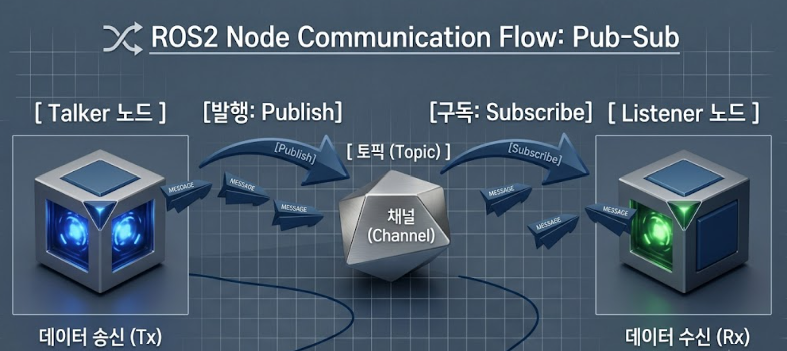
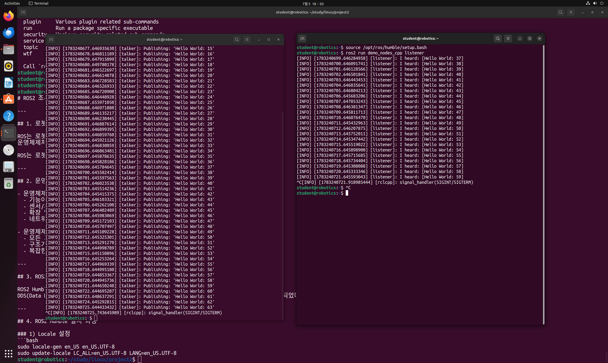
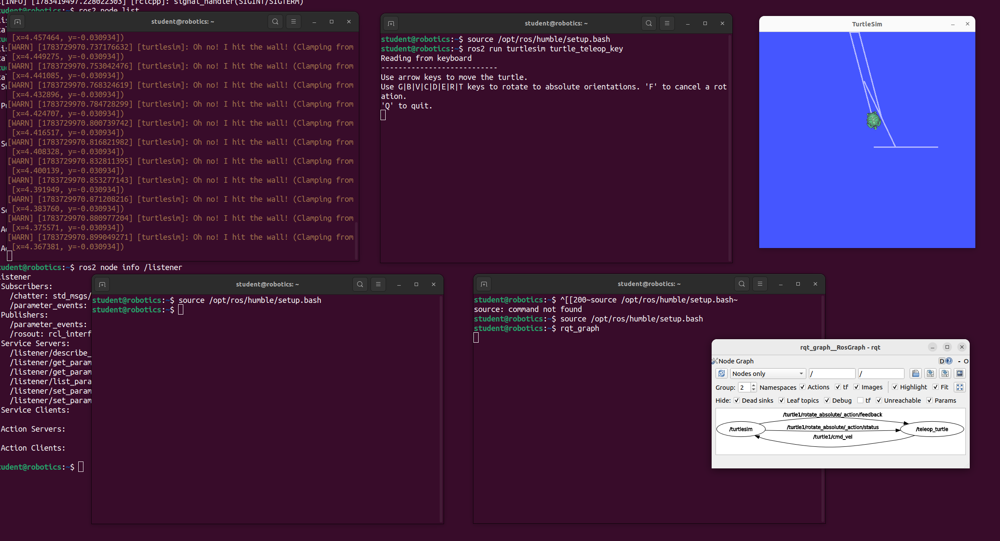

# ROS2 Node 학습 보고서

## 1. ROS2의 Node란?

ROS2에서 노드(Node)는 하나의 기능을 수행하는 실행 단위로 가장 작은 최소 단위 입니다.

### 1. 노드(Node)의 주요 특징
노드의 주요 특징은 총 3가지로 볼 수 있습니다.  
독립성, 분산 아키텍처, 상호작용이 있습니다.
- **독립성**: 각 노드는 하나의 독립적인 프로세스(Process)로 실행하기에  
만약 한 노드에서 에러가 생겨도 다른 노드들에는 영향이 없어 시스템 안정성이 높습니다.

- **분산 아키텍처**: 로봇의 노드란 분리삭 개발이라 모듈화가 쉽고 유지보수 및 코드 재사용에 용이 합니다.

- **상호작용**: 여러 통신 방식으로 다른 노드와 데이터를 주고받습니다.  
ex) 토픽(Topic), 서비스(Service), 액션(Action)

### 2. 노드(Node)와 패키지(Package)의 차이
- **노드(Node)**: 실제 연산을 수행하고 OS에서 독립적으로 실행되는 프로그램(파일)이자 하나의 기능을 수행하는 최소 단위 입니다.

- **패키지(Package)**: 노드들의 소스 코드나 실행 파일, 설정 파일 등을 위한 폴더 입니다.

### 3. 노드의 종류
Talker와 Listener는 Node의 한 종류로 Ros2의 데이터를 주고받는 역할을 합니다.
Talker에 데이터가 들어오면 Listener가 출력하는 방식 입니다.

- **Talker**:  메시지를 발행하는 퍼블리셔(Publisher) 노드 중 하나로 특정 문자열을 Talker로 전송합니다.

- **Listener**:  메시지를 구독하는 서브스크라이버(Subscriber) 노드 중 하나로 Talker가 보낸 데이터를 실시간으로 수신하여 화면에 출력하거나 처리합니다.

## 2. Talker와 Listener

### 1. Talker와 Listener의 통신 프로세스
흐름도  

실제 코드  

### 2. Turtlesim 노드 간 통신 프로세스

