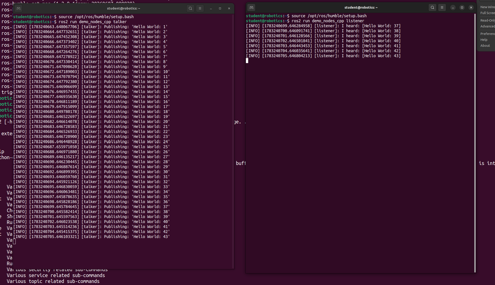

# ROS2 조사 및 실습 보고서

## 1. 로봇 운영체제(Robot Operating System, ROS) 개념

ROS는 로봇 소프트웨어 개발을 위한 오픈소스 미들웨어 프레임워크이다.  
운영체제처럼 보이지만 실제로는 OS 위에서 동작하는 로봇 전용 소프트웨어 플랫폼이다.
ROS는 로봇의 센서, 모터, 제어 시스템 등을 하나의 구조로 연결해주는 역할을 한다.


## 2. 운영체제를 사용하는 로봇과 사용하지 않는 로봇의 차이

- 운영체제를 사용하는 로봇
  - 기능이 모듈화되어 있음
  - 센서/제어/통신이 분리되어 있음
  - 확장 및 유지보수가 쉬움
  - 네트워크 기반 협업 가능 
<br><br>
- 운영체제를 사용하지 않는 로봇
  - 모든 기능이 하나의 코드에 포함됨
  - 구조가 단순하지만 확장성이 낮음
  - 복잡한 기능 구현이 어려움

## 3. ROS2 Humble 소개

ROS2 Humble은 Ubuntu 22.04 LTS에서 사용되는 ROS2 배포 버전이다.  
DDS(Data Distribution Service)를 기반으로 한 통신 구조를 사용하며 실시간성과 안정성이 향상되었다.

## 4. ROS2 Humble 설치 과정

### 1) Locale 설정
```bash
sudo locale-gen en_US en_US.UTF-8
sudo update-locale LC_ALL=en_US.UTF-8 LANG=en_US.UTF-8
```

### 2) Universe 저장소 활성화
```bash
sudo add-apt-repository universe
sudo apt update
```

### 3) ROS2 저장소 등록
```bash
sudo curl -sSL https://raw.githubusercontent.com/ros/rosdistro/master/ros.key \
-o /usr/share/keyrings/ros-archive-keyring.gpg
echo "deb [arch=amd64 signed-by=/usr/share/keyrings/ros-archive-keyring.gpg] http://packages.ros.org/ros2/ubuntu jammy main" | sudo tee /etc/apt/sources.list.d/ros2.list
 ```

### 4) ROS2 설치
```bash
sudo apt update
sudo apt install -y ros-humble-desktop
 ```

### 5) 환경 설정
```bash
source /opt/ros/humble/setup.bash
echo "source /opt/ros/humble/setup.bash" >> ~/.bashrc
```

## 5. 패키지와 노드
- 패키지(Package): ROS2 기능을 묶어놓은 단위
- 노드(Node): 실행되는 최소 프로그램

## 6. ROS2 run 사용법
```bash
ros2 run <package_name> <executable_name>
 ```
예시
```bash
ros2 run demo_nodes_cpp talker
```
## 7. Talker/Listener 사용법
실행방법 <br>
--> 터미널 두개 사용할 것

터미널 1(Talker)
 ```bash
ros2 run demo_nodes_cpp talker
```

터미널 2(Listener)
```bash
ros2 run demo_nodes_cpp listener
```
 결과
- Talker는 "Hello World" 메시지를 publish
- Listener는 해당 메시지를 실시간으로 수신

[이미지 참고] <br>


## 8. ROS2 통신 구조
ROS2는 Topic 기반 통신 구조를 사용한다.
- Publisher (talker): 데이터 전송
- Subscriber (listener): 데이터 수신
- DDS middleware가 중간에서 통신을 연결

## 9. ROS2 run 실행의 의미
ROS2 run 명령어는 ROS2 패키지 안에 있는 실행 파일을 실행하는 명령어다.

## 10. 프로젝트 구조
```
home/
└── student/
    └── study/
        └── linux/
            └── project02/
                └──  2_ros.md
```
